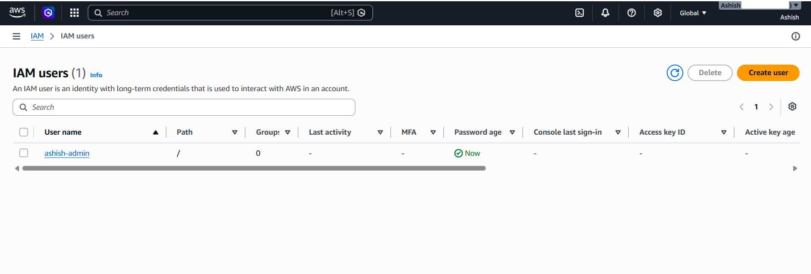
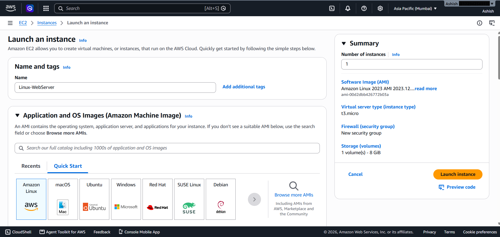
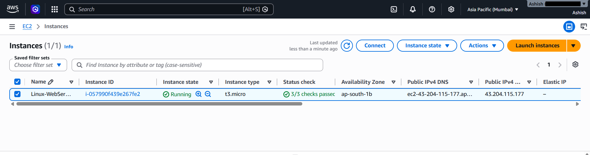
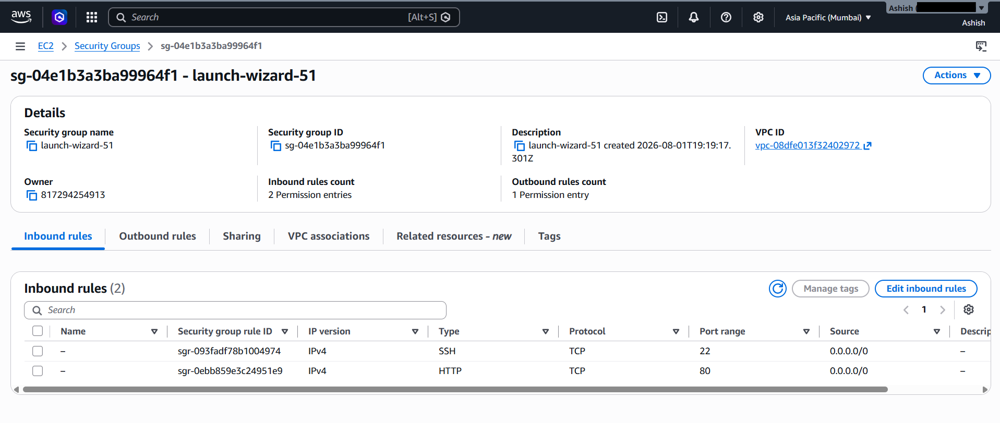
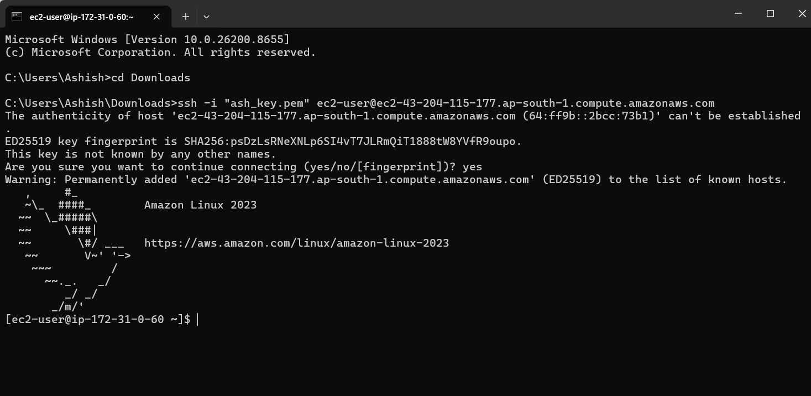
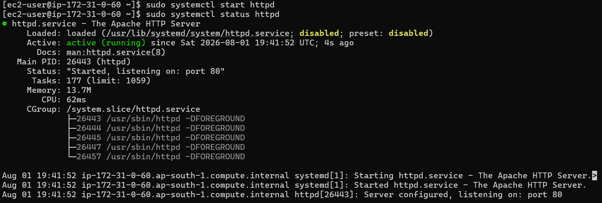
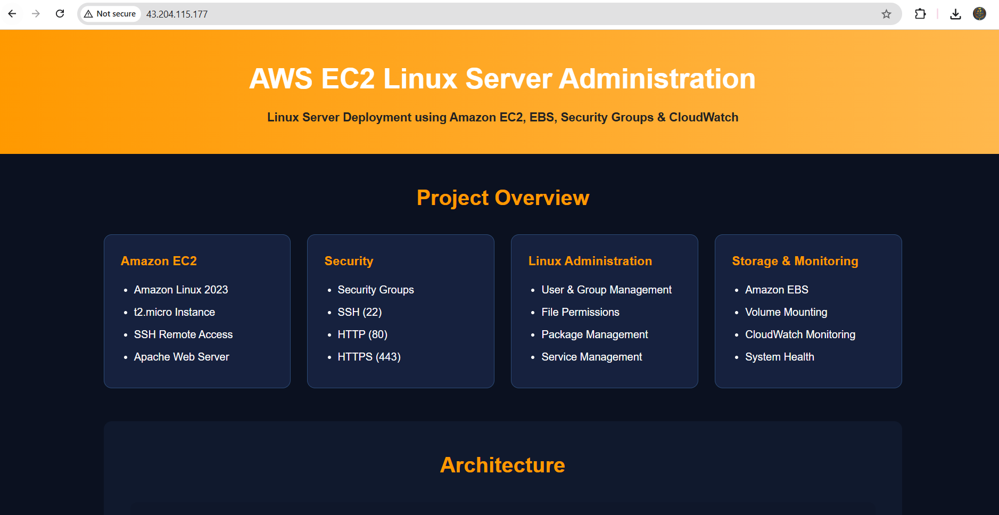
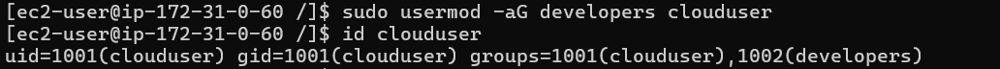
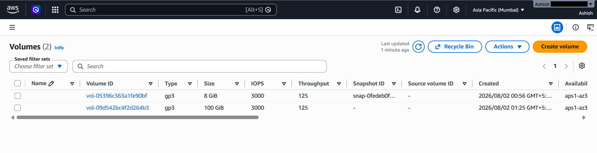
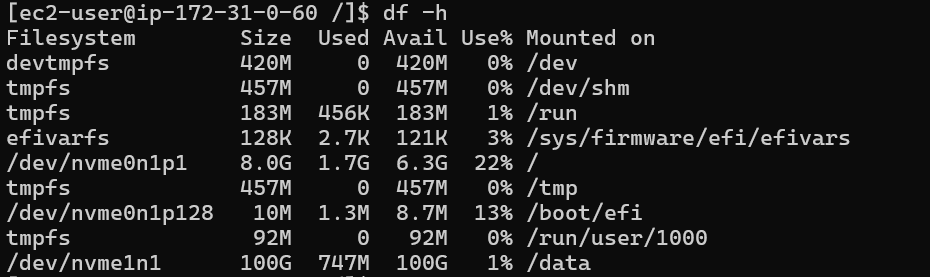

# AWS EC2 Linux Server Administration

## Project Description

This project demonstrates the deployment, configuration, and administration of an Amazon Linux 2023 server on AWS using Amazon EC2. It covers essential cloud infrastructure, Linux system administration, web server configuration, storage management, and monitoring services commonly used in production environments.

---

## Project Objective

The objective of this project is to gain practical hands-on experience in deploying and managing a Linux server on AWS Cloud. It demonstrates secure server access, web hosting, Linux administration, storage configuration, and monitoring using AWS services.

---

## AWS Services Used

- Amazon EC2
- AWS IAM
- Security Groups
- Key Pair
- Amazon Linux 2023
- Apache HTTP Server (httpd)
- Amazon EBS
- Amazon CloudWatch

---

## Project Features

- Launch Amazon EC2 Instance
- Configure Security Groups
- Secure SSH Remote Access
- Install and Configure Apache HTTP Server
- Deploy Static HTML Website
- Linux User and Group Management
- File Permission Management
- Amazon EBS Volume Creation and Mounting
- Server Monitoring using CloudWatch

---

## Project Architecture

The project follows a simple Linux web server architecture where users access a website hosted on an Amazon EC2 instance protected by Security Groups. The server runs Apache HTTP Server, stores additional data using Amazon EBS, and is monitored using Amazon CloudWatch.

Architecture Diagram:

```
Internet
     │
Security Group
     │
Amazon EC2 (Amazon Linux 2023)
     │
 ├── Apache HTTP Server
 ├── Linux Administration
 ├── Amazon EBS
 └── Amazon CloudWatch
```

---

## Project Workflow

1. Created an IAM Administrator User
2. Launched an Amazon Linux 2023 EC2 Instance
3. Configured Security Groups
4. Connected to EC2 using SSH
5. Installed Apache HTTP Server
6. Hosted a Static HTML Website
7. Created Linux Users and Groups
8. Managed File Permissions
9. Attached and Mounted Amazon EBS Volume
10. Verified Server Health using CloudWatch

---

## Project Documentation

Complete project documentation with screenshots and explanations is available in the **Documentation** folder.

---

## Project Screenshots

All AWS Console and Linux Terminal screenshots are available in the **Screenshots** folder.

---

## Commands

Frequently used Linux and AWS commands are available in **Commands.md**.

---

## Skills Demonstrated

- AWS Cloud Computing
- Amazon EC2
- Linux Administration
- SSH
- Apache Web Server
- AWS IAM
- Security Groups
- Amazon EBS
- CloudWatch Monitoring
- Linux File Permissions
- User & Group Management

---

## Author

**Ashish J Talekar**

AWS Cloud | Linux Administration | Networking

GitHub: https://github.com/Ashish-Talekar

LinkedIn: https://www.linkedin.com/in/ashish-talekar/

---

## License

This project is licensed under the MIT License.

# Project Screenshots

## 1. IAM User Creation


---

## 2. EC2 Instance Configuration


---

## 3. EC2 Instance Running


---

## 4. Security Group Configuration


---

## 5. SSH Connection to EC2


---

## 6. Apache HTTP Server Running


---

## 7. Website Successfully Hosted


---

## 8. Linux User & Group Management


---

## 9. Amazon EBS Volume Created & Attached


---

## 10. Amazon EBS Successfully Mounted

